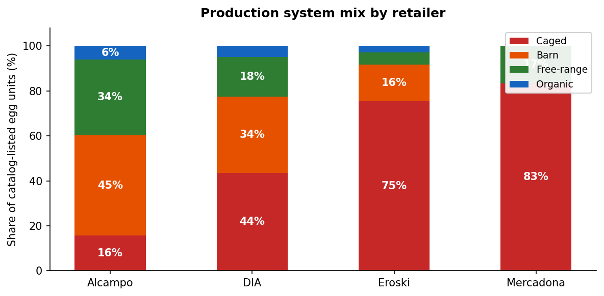

# Egg Production System vs Cage-Free Progress — Spanish Retailers

*Scraped: 2026-05-10 11:49:30*

| Retailer  | Caged % | Barn % | Free-range % | Organic % | Listed cage-free % | Reported cage-free % | As of |
| --------- | ------- | ------ | ------------ | --------- | ------------------ | -------------------- | ----- |
| Alcampo   | 16%     | 45%    | 34%          | 6%        | 40%                | 63%                  | 2023  |
| DIA       | 44%     | 34%    | 18%          | 5%        | 23%                | —                    | —     |
| Eroski    | 75%     | 16%    | 5%           | 3%        | 8%                 | 35%                  | 2018  |
| Mercadona | 83%     | 0%     | 17%          | 0%        | 17%                | 65%                  | 2024  |

**Listed cage-free %** = share of catalog-listed egg units (pack quantity × SKUs) that is free-range or organic. Does not reflect actual sales weighting.

**Reported cage-free %** = most recent self-reported figure for egg sales. Sources: retailer press releases; Animal Welfare Observatory (OBA); EggTrack 2024 (CIWF).

**Note**: listed cage-free % likely does not reflect actual sales volume, so is not a reliable metric of % cage-free sales.
